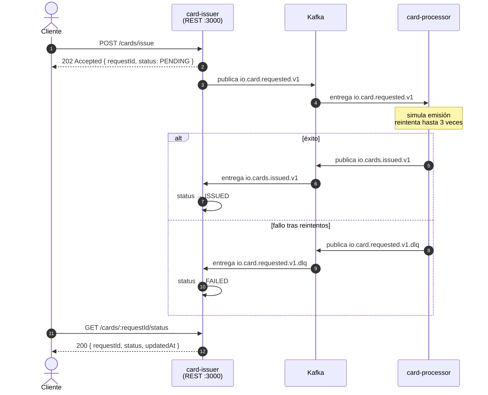

# io-card-issuing

Sistema de emisión de tarjetas basado en eventos construido con NestJS, Kafka y SQLite — prueba técnica IO Neobanco.

## Arquitectura

El cliente HTTP interactúa únicamente con `card-issuer`. La emisión real de la tarjeta ocurre de forma asíncrona: `card-issuer` publica un evento en Kafka y `card-processor` lo procesa. Una vez que `card-processor` termina, publica el resultado de vuelta en Kafka y `card-issuer` lo consume para actualizar el estado de la solicitud.



> Todos los eventos de un mismo flujo comparten el mismo `source` (= `requestId`), lo que permite trazarlos en logs y en Kafka UI.

| Servicio | Rol | HTTP | Kafka produce | Kafka consume | Persistencia |
|---|---|---|---|---|---|
| `card-issuer` | Admisión + consulta de estado | `:3000` | `io.card.requested.v1` | `io.cards.issued.v1`, `io.card.requested.v1.dlq` | SQLite `card_requests` |
| `card-processor` | Emisión + reintentos | — | `io.cards.issued.v1`, `io.card.requested.v1.dlq` | `io.card.requested.v1` | SQLite `cards` |

---

## Levantar el entorno

### Stack completo en Docker (demo / entrega)

Levanta Kafka, kafka-ui, card-issuer y card-processor en contenedores:

```bash
docker compose up
```

> La primera vez construye las imágenes (~2 min). En ejecuciones siguientes usa la caché.

```bash
docker compose up --build   # forzar rebuild de las imágenes
docker compose up -d        # modo detached (background)
docker compose down         # detener y eliminar contenedores
```

**Servicios disponibles:**

| URL | Descripción |
|---|---|
| http://localhost:3000/docs | Swagger UI — card-issuer |
| http://localhost:3000/cards/issue | `POST` solicitar emisión de tarjeta |
| http://localhost:3000/cards/:requestId/status | `GET` consultar estado del flujo |
| http://localhost:8080 | kafka-ui — inspeccionar tópicos y mensajes |

**Prueba rápida:**

```bash
# 1. Solicitar emisión de tarjeta → devuelve requestId
curl -s -X POST http://localhost:3000/cards/issue \
  -H "Content-Type: application/json" \
  -d '{
    "customer": {
      "documentType": "DNI",
      "documentNumber": "12345678",
      "fullName": "Ana García",
      "age": 28,
      "email": "ana@example.com"
    },
    "product": { "type": "VISA", "currency": "PEN" },
    "forceError": false
  }' | jq

# 2. Consultar el estado del flujo (reemplazar <requestId> con el valor del paso anterior)
curl -s http://localhost:3000/cards/<requestId>/status | jq
```

> Esperar ~1-2 segundos entre ambos comandos para que el `card-processor` complete la emisión. El estado pasará de `PENDING` a `ISSUED`.


**Tests de integración con el stack real:**

```bash
# Con el stack corriendo
cd card-issuer && npm run test:integration

# Apuntar a otro entorno (staging, CI, etc.)
cd card-issuer && ISSUER_URL=http://staging:3000 npm run test:integration
```

Ejercita el flujo completo sin mocks: HTTP → Kafka → card-processor → Kafka → card-issuer → SQLite.

---

### Solo Kafka (desarrollo local)

Para desarrollar los servicios localmente con watch mode, levanta solo el broker:

```bash
docker compose up kafka
```

Luego, en terminales separadas:

```bash
# Terminal 1
cd card-issuer
npm install
npm run start:dev

# Terminal 2
cd card-processor
npm install
npm run start:dev
```

Los servicios locales conectan a Kafka via `localhost:9094` (valor por defecto en los `.env`).

---

## Tests

```bash
# Unitarios (card-issuer)
cd card-issuer && npm test

# Unitarios con coverage (card-issuer)
cd card-issuer && npm run test:cov

# E2E (card-issuer — no requiere Kafka)
cd card-issuer && npm run test:e2e

# Unitarios (card-processor)
cd card-processor && npm test

# Unitarios con coverage (card-processor)
cd card-processor && npm run test:cov
```

---

## Flujo de un request

1. `POST /cards/issue` → 202 Accepted `{ requestId, status: "PENDING" }`
2. card-issuer publica `io.card.requested.v1` en Kafka
3. card-processor consume el evento y reintenta hasta 4 veces (backoff 1s / 2s / 4s)
   - Éxito → publica `io.cards.issued.v1`
   - Fallo total → publica `io.card.requested.v1.dlq`
4. card-issuer consume el resultado y actualiza `card_requests.status` a `ISSUED` o `FAILED`
5. `GET /cards/:requestId/status` → 200 `{ requestId, status, updatedAt }`

### Forzar el camino DLQ

Enviar `forceError: true` en el payload hace que el processor falle en todos los intentos de forma determinística:

```json
{
  "customer": { "documentType": "DNI", "documentNumber": "22222222",
                "fullName": "Test DLQ", "age": 30, "email": "dlq@example.com" },
  "product": { "type": "VISA", "currency": "USD" },
  "forceError": true
}
```

---

## Tópicos Kafka

| Tópico | Publicado por | Consumido por |
|---|---|---|
| `io.card.requested.v1` | card-issuer | card-processor |
| `io.cards.issued.v1` | card-processor | card-issuer |
| `io.card.requested.v1.dlq` | card-processor | card-issuer |
